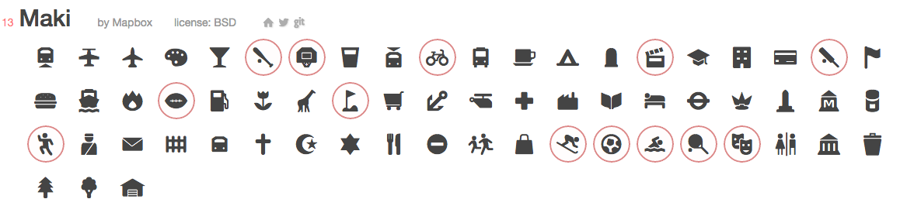

# sportsfont
A font containing icons for sports.

This font was created using http://www.fontello.com .

Some icons are taken from Maki by Mapbox - you can find this on fontello.

The selected icons i used were:

Some icon SVG images were found on http://www.flaticon.com .

# Classes
To view the different class contained in this icon set - please pull the project and view demo.html in a browser of your choice.

Alternatively, view the following image containing samples of the icons:

# Installation
## Manual
To install the sports font manually, download the source and include the following files:

./css/sports.css

All font files contained in ./font will need to be stored relative to the css directory. If you would like to store the font on a different path, the paths at the top of ./css/sports.css
will need to be modified.

## Bower
Sportsfont also now exists on bower and as such it can be install using the command:

`bower install sportsfont`

Use this font as you will - I don't mind!

# Adding to the font

Please use the great tool fontello, the icons I added are contained in the ./src folder.
